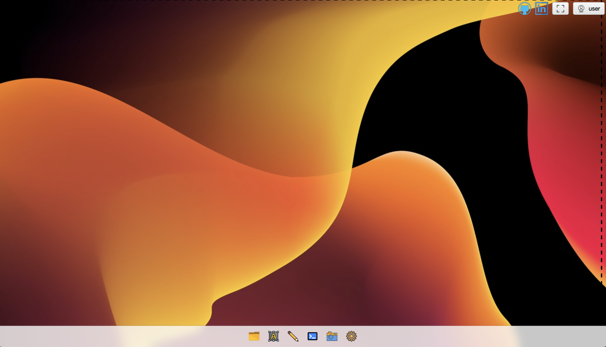

### Web Desktop (Under construction)

Hey! 

I want to create an open source prototype of a small web desktop written on javascript (angular) front-end and java on the back-end. It's a gut idea to have functional applications like a terminal app, draw app, text editor, photo viewer, and media player onboard. It would be workable with primitive functionality. See later!
I will be glad and pleased to listen to some critiques about my code or ideas. Helping is welcome.

Best Regards!

What do we have just now? A little bit, but still:
- web view with background, taskbar, and app icons
- ability to select regions on the web view(let's see in web console)
- capable full-window mode

All icons uploaded from https://www.svgrepo.com and will be changed later in our versions.
