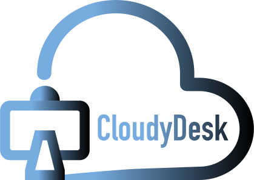
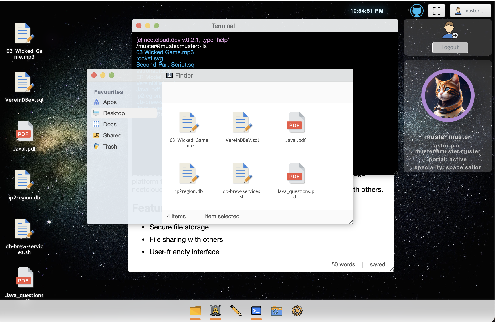

# CloudyDesk App

[](https://semver.org/spec/v1.0.0.html)
[](./LICENSE)

<p align="center">
  
</p>

<p align="center">
  CloudyDesk App - A web-based cloud desktop for users (In Progress)
</p>

<p align="center">
  	<a href="https://cloudydesk.de" >See Demo</a>
  	<br>
  	<b>Anonymous User was deleted. Please create own account or use current:</b>
</p>
<p align="center">
	<b>login: muster@muster.muster</b>
</p>
<p align="center">
	<b>password: muster</b>
</p>
<p align="center">
  
</p>

## About
CloudyDesk App is in a progressive state.
CloudyDesk is an app for the web. It’s a dynamic site with a database Postgres on board. The main goal of this website is to make a useful and friendly cloud like a desktop manager, which is a little bit similar to shell OS. So we plan to have our small functional embedded applications like a terminal app, draw app, text editor, photo viewer, media player, etc. It would be workable with simple functionality.
CloudyDesk App is Open Source App. You can download the code and make your changes.

## Features (Application in Progress)

- An animated web view featuring a background with a space, ocean, moon, among themes, a taskbar, and app icons.
- An animated loader system bar that indicates the progress of space settings and messages.
- Full-window mode capability for the desktop, allowing you to maximize the desktop view and occupy the entire screen.
- Modal windows that can be triggered from taskbar icons, providing options to close, maximize, minimize, move, and resize windowed applications. You can also switch between active windowed apps with a single click, even when other windowed apps are open. Resizing can be done using the bottom-left icon.
- The app terminal allows you to input commands such as "help," "ls," "whoami," and "uname." Other commands are currently being developed.
- The app finder displays a list of files organized by directories, which are automatically added when creating a new account. It's possible to drag and drop files from desktop to directories to save on backend. 
- The app settings provides to choose current thema from space, ocean, moon, among solar system themes. By default is space thema.
- The app editor provides a simple text editor interface without the option to save files.
- The app camera allows you to connect your webcam and view yourself.
- Context-menu functionality, left-clicking, including the ability to upload files to the server. The file can be saved based on the context of where you selected the menu - either in the finder or on the desktop. Other options in progress.
- Login and registration forms and functionality, including server calls and a widget panel displaying user information.
- Visual representation of file lists and the ability to upload files to storage for the current user by context-menu and selected folders in the sidebar of the finder.
- Double-clicking on file icons enables file downloading.
- Notifications have been implemented in the project.
- A loading spinner is activated to indicate ongoing processes.

### Please read this
- There is currently no demo available on the website [https://cloudydesk.de](https://cloudydesk.de). Please use the following login credentials:
	login: muster@muster.muster
	password: muster
- After loading the Docker image to start, please follow the instructions below.
- If you have started the Docker image and the database is empty, create your own account and upload your files. The default file upload size limit is 10 MB.
- In the Docker image, the path 'upload-dir' is set by default. Please refer to the file 'server/src/main/resources/application.yml' to select your own directory to work locally, to which you have access.

## Development

### Important for local usage

- Our development uses reverse proxy server. In this file [nginx.conf](./nginx/nginx.conf) you can find example proxy settings. Front-end server starts on port 8081 and backend starts in port 3000.
- File Store uses by default ```home:/user:/uploads``` directories. Please make dir ```/uploads``` in your /Home:/User: dir and change [application.properties:40](./server/src/main/resources/application.yml#L26).

### Docker meugenom/neetcloud image from Docker Hub

Here is a way to run the project locally:

```bash
	# install docker and download image using command below
	docker pull meugenom/cloudydesk:0.2.4
	# see images
	docker images
	# run image with the folowing command
	docker run -d --name cloudydesk-container -e POSTGRES_USER=cloudydesk -e POSTGRES_PASSWORD=password -p 5432:5432 -p 8080:8080 -p 8081:8081 cloudydesk:0.2.5
	# see started containers
	docker ps
	# after wann container is launched, run the command to connect to the container
	docker exec -it cloudydesk-container bin/bash
	# in the opened console start each service one by one with the following commands:
	nginx && start-frontend && start-backend
	# you can see all started processes
	htop
	# and quit from the terminal of container
	exit
```
	- Access the project in web browser at `http://localhost:8080`.
	By default database is empty.
	- Register new user by button bottom-right 
	- Upload file by right click on the screen->see menu->select Uploading File
	- Download file from the screen -> double click on icon of downloaded file

How to remove docker build cache
```bash
	docker builder prune
```

NeetCloud App was created with TypeScript, Angular, Ng Redux, Java, Spring Framework, and Postgres. Please see:

- Code:
  - [client code in progress](./client/)
  - [server code in progress](/server/)

- Info:
  - [client readme](./client/README.md)
  - [server readme](./server/README.md)

I'll be glad and pleased to listen to some critiques about the code or ideas. **Helping is welcome**.

### Used Resources

- All icons uploaded from [www.svgrepo.com](https://www.svgrepo.com) and will be changed later in our versions.
- Space Background's Picture downloaded from Unsplash.com (Gary Scott).
- Theme 'Among' was injected from resource: [@Mamboleoo - Louis Hoebregts](https://codepen.io/Mamboleoo/pen/WNxOvjo), 'Moon' from resource: [@aris_acoba - Aris Acoba](https://codepen.io/aris_acoba/pen/vzyJJQ), 'Solar System' from resource: [@kowlor Malik Dellidj](https://codepen.io/kowlor/pen/ZYYQoy).
## Contributors

_You could be here!_

## Author

- [meugenom](https://meugenom.com)

## License

This project is open source and available under the [MIT License](./LICENSE).
