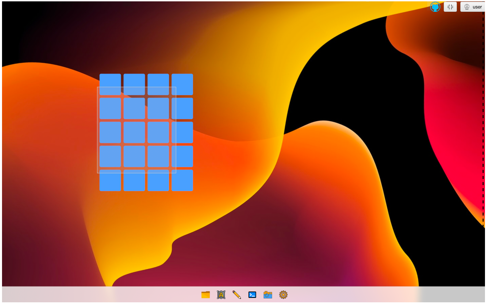
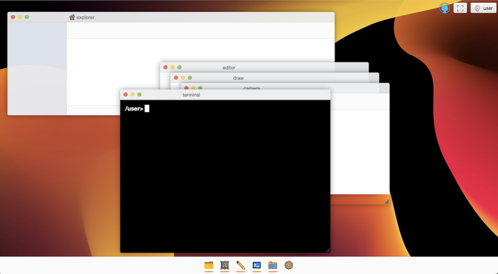

### Web Desktop (Under construction)

#### Hey! 

I want to create an open source prototype of a small web desktop written on javascript (angular) front-end and java on the back-end. It's a gut idea to have functional applications like a terminal app, draw app, text editor, photo viewer, and media player onboard. It would be workable with primitive functionality. See later!
I will be glad and pleased to listen to some critiques about my code or ideas. Helping is welcome.

Best Regards!

**What do we have just now?** 
A little bit, but still:
- web view with background, taskbar, and app icons
- ability to select regions on the web view(let's see in web console)
- capable desktop's full-window mode
- modals from taskbar apps (explorer, editor, draw, terminal, camera, settings) with options:
	- close window-app
	- maximize window-app / back to small window-app
	- minimize window-app / back to small window-app
	- moving window-app by head on the desktop screen
	- make window-app active with click when we have other opened window-apps
	- resizing window-app by left-bottom icon




All icons uploaded from [www.svgrepo.com](https://www.svgrepo.com) and will be changed later in our versions.

dirs:
```
src
 |--app
	 |--global.ts
	 |--app.module.ts
	 |--app.component.ts
	 |--app.component.html
	 |--app.component.sass
	 |--app-routing.module.ts
	 |--app-component.spec.ts

 |--camera
     |--camera.component.ts
	 |--camera.component.spec.ts
	 |--camera.component.html
	 |--camera.component.sass

 |--desktop
	 |--desktop.component.ts
	 |--desktop.component.spec.ts
	 |--desktop.component.html
	 |--desktop.component.sass

 |--draw
     |--draw.component.ts
	 |--draw.component.spec.ts
	 |--draw.component.html
	 |--draw.component.sass

 |--editor
     |--editor.component.ts
	 |--editor.component.spec.ts
	 |--editor.component.html
	 |--editor.component.sass

 |--explorer
     |--explorer.component.ts
	 |--explorer.component.spec.ts
	 |--explorer.component.html
	 |--explorer.component.sass

 |--fullscreen
	 |--fullscreen.directive.ts
	 |--fullscreen.directive.spec.ts

 |--modal
	 |--modal.module.ts
	 |--modal.service.ts
	 |--modal.component.ts
	 |--modal.component.sass
	 |--modal.component.html

 |--taskbar
	 |--taskbar.component.ts
	 |--taskbar.component.spec.ts
	 |--taskbar.component.sass
	 |--taskbar.component.html

 |--terminal
     |--terminal.component.ts
	 |--terminal-core.js
	 |--terminal.component.spec.ts
	 |--terminal.component.html
	 |--terminal.component.sass

 |--settings
     |--settings.component.ts
	 |--settings.component.spec.ts
	 |--settings.component.html
	 |--settings.component.sass

 |--assets
	 |--css
	 	 |-- styles.sass
		 |--components/...

	 |--img/
 |--index.html
 |--main.ts
```