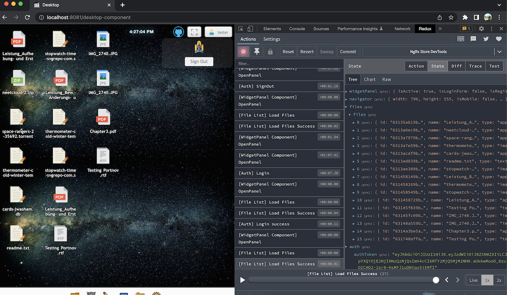

[](https://semver.org/spec/v1.0.0.html)
[](./LICENSE)

<p align="center">
	NeetCloud App - A web-based cloud desktop for users (In Progress)
</p>

<p align="center">
	
</p>

<p align="center">
	<a href="https://neetcloud.dev" >See Demo</a>
	<p align="center">!Important: Anonymous User was deleted. Please use tester or create own account:</p>
	<p align="center">login: tester</p>
	<p align="center">password: tester</p>
</p>

<p align="center">
	
</p>

#### **About**
Neetcloud App is in a progressive state.
NeetCloud is an app for the web. You can use the demo app at neetcloud.dev. It’s a dynamic site with a database MongoDB on board. The main goal of this website is to make a useful and friendly cloud like a desktop manager, which is a little bit similar to shell OS. So we plan to have our small functional embedded applications like a terminal app, draw app, text editor, photo viewer, media player, etc. It would be workable with simple functionality.
NeetCloud App is Open Source App. You can download the code and make your changes.

### **What do we have just now?**

### **Features** (Application in Progress)

- animated web view with space background, taskbar, and app icons
- capable desktop's full-window mode
- modals start from taskbar icons:
  - closing, maximize, minimize, moving window-app / back to small window-app
  - make window-app active with click when we have other opened window-apps
  - resizing window-app by left-bottom icon
- in app terminal ability to input commands, "clear" for example, others in progress
- selection files on the desktop and in Finder and change places between (drag and drop)
- context-menu (works uploading file to the server)
- login's and register's forms and functionality, actions, calls to the server, widget panel
- getting file list visual and uploading file to the storage by current user
- download file by double clicking on file icon
- added Notifications into the project

All icons uploaded from [www.svgrepo.com](https://www.svgrepo.com) and will be changed later in our versions.
Space Background's Picture downloaded from Unsplash.com (Gary Scott).

#### **Development**

!Important: 
- Our development uses reverse proxy server. In this file [nginx.conf](./nginx/nginx.conf) you can find example proxy settings. Front-end server starts on port 8081 and backend starts in port 3000. 
-  Other way to proxy, please uncomment string [Backend: NeetCloudApplication.java:70](./server/src/main/java/dev/neetcloud/api/NeetCloudApplication.java#L70) and change port from 8080 to 3000 in [Frontend: environment.ts](./client/src/environments/environment.ts)
- File Store uses by default ```home:/user:/uploads``` directories. Please make dir ```/uploads``` in your /Home:/User: dir and change [application.properties:26](./server/src/main/resources/application.properties#L26).

NeetCloud App was created with TypeScript, Angular, Ng Redux, Java, Spring Framework, and MongoDB-community. Please see:

- Code:
  - [client code in progress](./client/)
  - [server code in progress](/server/)

- Info:
  - [client readme](./client/README.md)
  - [server readme](./server/README.md)

I'll be glad and pleased to listen to some critiques about the code or ideas. **Helping is welcome**.

### **Contributors**

_You could be here!_

#### **Author**

- [meugenom](https://meugenom.com)

#### **License**

This project is open source and available under the [MIT License](./LICENSE).